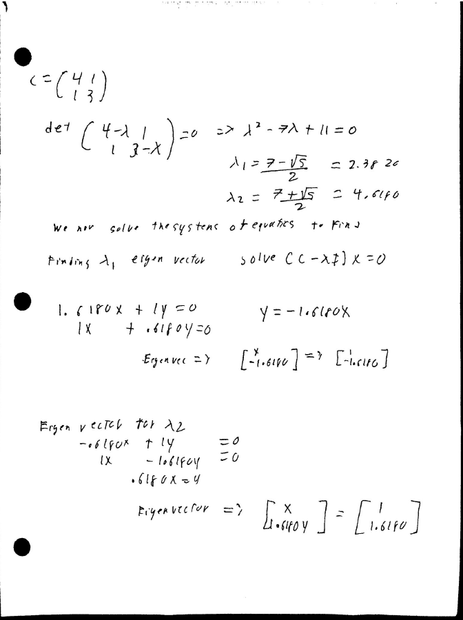
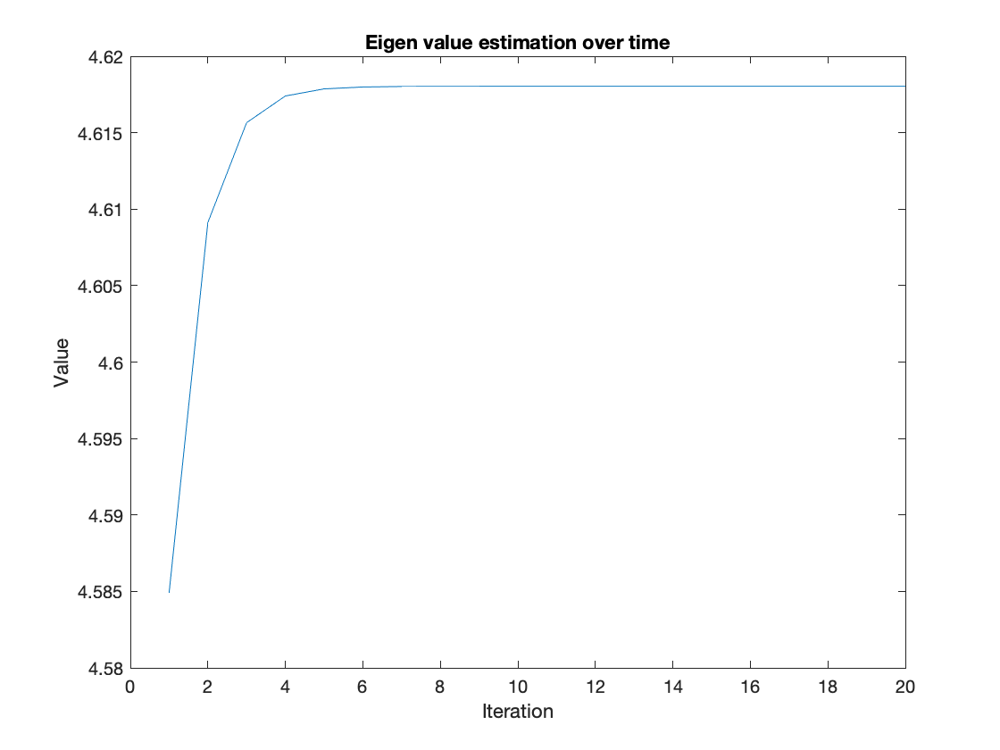
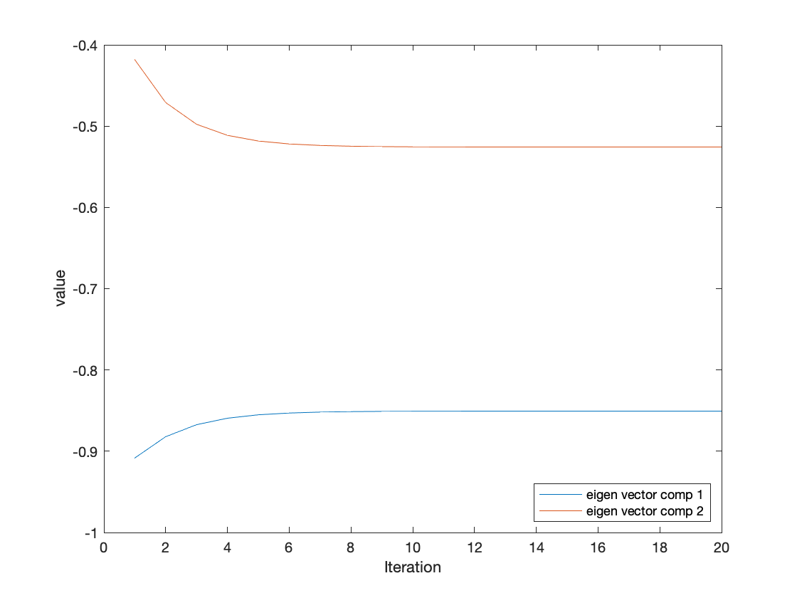
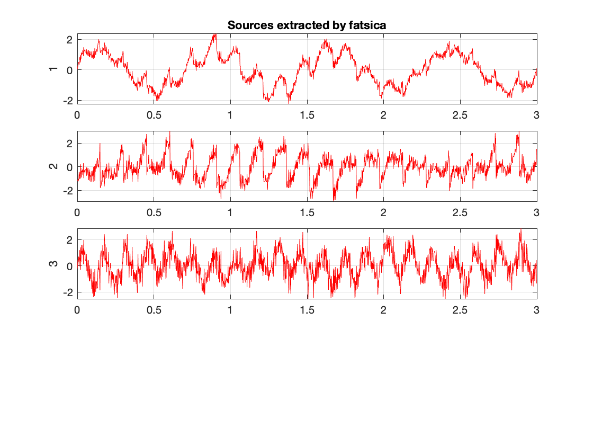
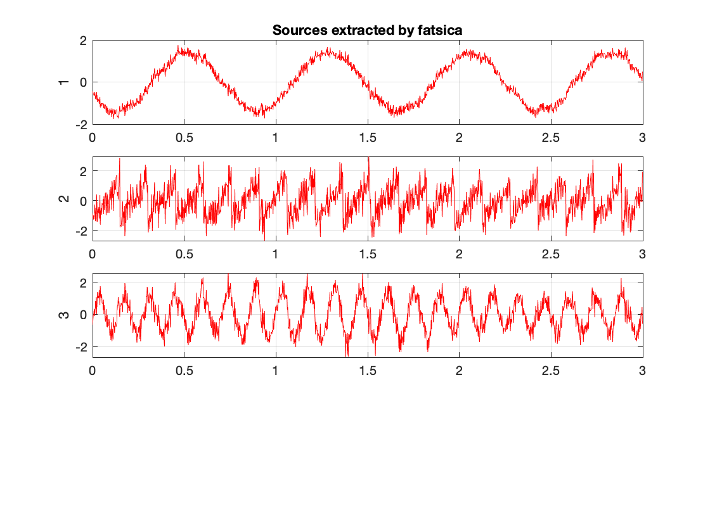

# question 1 
A)

B) 

We obtain similar eigenvalues to the one obtained  by matlab eig. For the eigenvector we had some initial diferences when it comes to the final values 
We were abled to obtain similar direction vectors but their individiual values are different. We ere able to rectify this by normalizing the vectors to unit norm. The script hw.m also includes the code for deriving the eigen vectors by "hand" using symbolic math solvers.

# question 2 

# question 3: execrises 

##  Ex 1 

here we change the dataset to use the sample dataset two. Our primary
change was to look into the 90th percentile in signal instead of the 99th
percentile. It is clearly evident that in some channels a lot of the
variability is no longer captured. Yet most of the trends are kept as one
would expect from PCA. 

## Ex 2 

For thsi section we  modified the iteration accunt to see how small the
iteration count could get to reliably estimate the eigne value.  Around
the 20 iteration count we see stable levels of performance. This is a
simpler signal and could perhaps not generalzie to larger matrices. 

## Ex 3 
for this section we compared the changes  caused by different
appriximation approaches. We observed tanh,pow3, and skew to view a small
subset of variability. We notice that  tanh and po3 have the greatest
agreeement. Meanwhile skew produces  slightly different results. Bellow  we have  the skew and tanh example outputs of fastica. 

 

## Ex 4 
noise removal utilizing NCSA seems to be more aggresive than using jade 
this is reflected in the summary statistics where the standard devieaiton
of the signal is smallest with nsca. At a high level observation the
signals appear to be rather similar. On closer inspection we can see
differences in denoising ocmparing signals from channel 1 and channel 3 
in the region with a rapid change seen in the 31 second mark we see that
jade trails behind the NSCA method. Suggesting that jade is more sensitive
to rapid changes in signals. Meanwhile for regions with a consistent
signal( i.e flat)  both methods are in agreement 

## Ex 5 

this script appears to be using several model estimation techniques to
fit a polynomial curve onto the the ECG signal.  It allows for an
interective interpretatatio nof the data which i find quite useful.
Interestingly enough we can get an ok fit with just 2 parameters to be fit producing an error of 1.82% 
 meanwhile for the 

# Reading report 

A comparison of PCA, KPCA, and ICA for dimensionality reduction in support vector machine 

SVM was adopted "due to its remarkable characteristics such as good generalization performance, the absense of local minima and the sparse representation no solution" . SVMs are liked since they have the tendency to minimize the upper bound of the generalization error. Traditionally most applications would have used the raw feature space to do classification, but this is meant with a few limitations. Model performance is impacted by the correlated nature of the raw features. The scientific community therefore adopted several feature selection and/or extractions to minimize the number of unnecessary techniques.  One series of feature extraction techniques that gained prominence was the dimensionality reduction techniques seen in PCA and KPCA. PCA using singular value decomposition produced a sieres of uncorrelated features. Meanwhile kernel PCA focuses on project the data onto a new space and applying linear PCA onto it. This allows KPCA to better generalize for non-linear features. ICA on the other hand focuses on identifying features that are statistically independent for each other. These different feature projection schemes result in varying feature sets, therefore, to validate their usefulness the researchers looked into 3 different datasets. They trained a SVM regression model of several openly available datasets. All 3 datasets had variables that provided a summary value of multiple events making their behavior nonlinear in most cases.  It is for this reason that the best performing model was thus the KPCA followed by ICA. Although the data appeared to originate from different smaller sources which could have benefited from ICAs source separations abilities the top performer was still    It is important to note that  although  KPCA was best performing it was also the slowest to run .  PCA was the fastest model followed by ICA. Suggesting there are potential trade off considerations to be had when deciding which program to be used.  ICA may not perform as well as KPCA but it’s quicker runtime would provide substantial benefit to biomedical applciaitons .